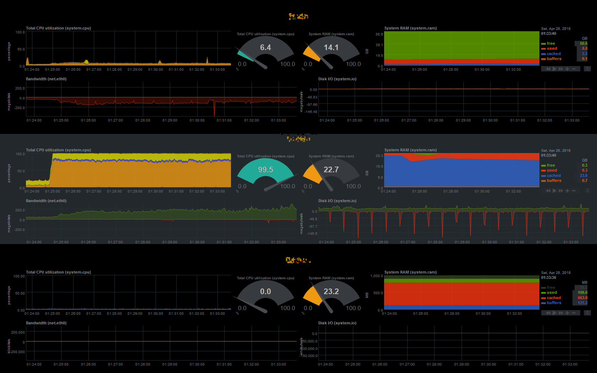

New netdata multi server layout replace `<replace with your netdata server>` and `<replace with your netdata slave>` as needed

# Setting up Master / Slave replication for Netdata

[Netdata Replication Documentation](https://github.com/firehol/netdata/wiki/Replication-Overview)

Mainly on the first server you generate a uuid and set it in the stream.conf file, then on your other servers you put the uuid and ip address from the first server into their stream.conf files.

# /etc/netdata/netdata.conf tweaks

I like to set the history on the master server a little longer and disable logging since we'll use an nginx reverse proxy which will log access for us.

`history = 14400`
`access log = none`

On the slave servers, disable a few things:

Under [global]

`memory mode = none`

Under [web]

`mode = none`

# Securing it

To secure it, I only open the service port 19999 on the master/web server and limit it to the ip addresses of the slave servers. Then have nginx reverse proxy to localhost:19999 with http auth. Finally setup a jail in fail2ban for too many failed http auths
